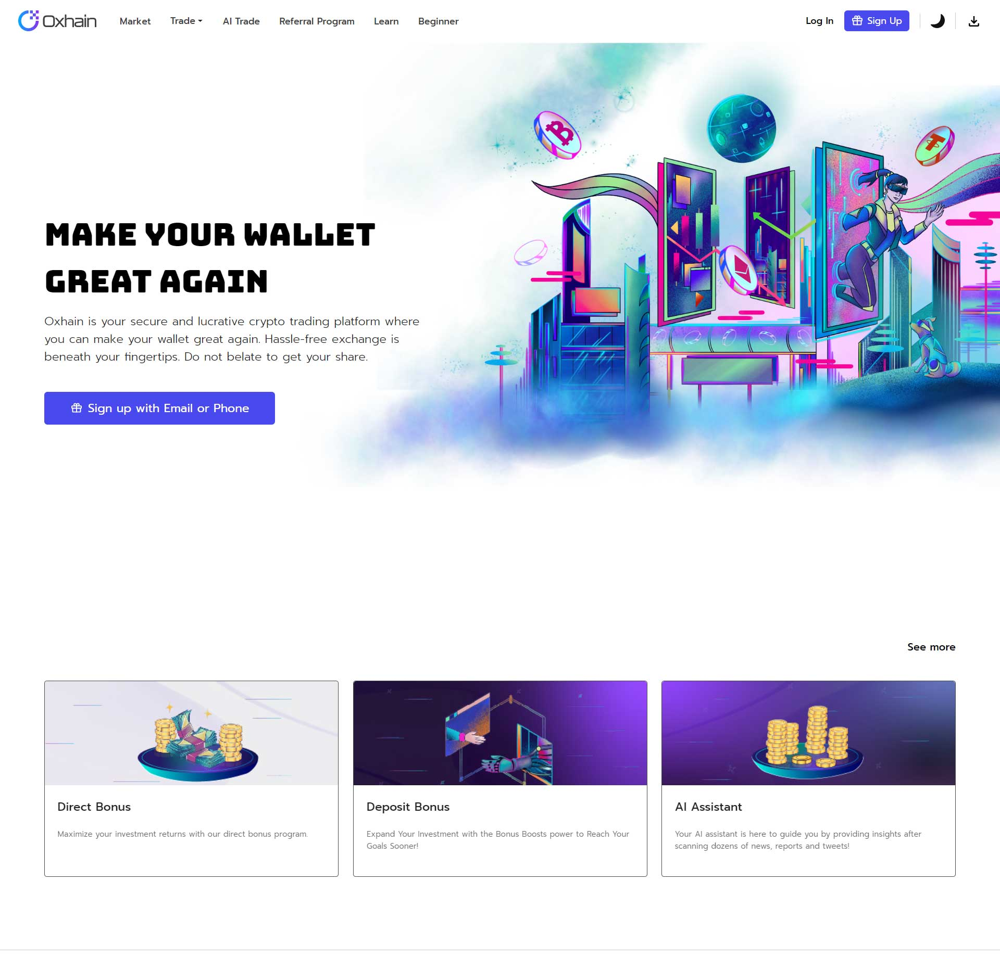

# React Blockchain Oxhain App



Welcome to the React Blockchain Oxhain App! This project demonstrates the basics of blockchain technology using a simple web application built with React and Node.js.

## Table of Contents

- [About](#about)
- [Features](#features)
- [Installation](#installation)
- [Usage](#usage)
- [Technologies Used](#technologies-used)
- [Contributing](#contributing)
- [License](#license)

## About

The React Blockchain Oxhain App provides a hands-on example of how blockchain works by creating a basic blockchain network with blocks and transactions. It showcases the fundamental concepts of blockchain, such as proof-of-work, mining, and decentralization.

## Features

- **Block Creation**: New blocks can be mined and added to the blockchain.
- **Transaction Handling**: Users can create transactions to add data to a block.
- **Proof-of-Work**: Mining process involves finding the right nonce for block validation.
- **Decentralization**: The blockchain is distributed across nodes for added security.

## Installation

To run this project locally, follow these steps:

1. Clone this repository to your local machine using `git clone https://github.com/muhammadshiraz/react-oxhain-app.git`.
2. Navigate to the project directory using `cd react-oxhain-app`.
3. Install the necessary dependencies for both the frontend and backend:

```bash
npm install
```

## Usage

In a separate terminal, start the frontend development server:

```bash
npm start
```

The app will now be accessible at http://localhost:3000.

## Technologies Used

## Frontend:

1. React: A JavaScript library for building user interfaces.
2. Axios: For making HTTP requests to the backend server.
3. Bootstrap: For basic styling and responsive design.

## Backend:

1. Node.js: A JavaScript runtime for server-side development.
2. Express: A web application framework for Node.js.
3. CryptoJS: For cryptographic functionality like hashing.

## Contributing

We welcome contributions from the community! To contribute to this project, follow these steps:

1. Fork this repository to your GitHub account.
2. Create a new branch with a descriptive name: git checkout -b feature/your-feature.
3. Make your changes and commit them: git commit -m "Add your message here".
4. Push the changes to your branch: git push origin feature/your-feature.
5. Open a pull request on this repository with a detailed description of your changes.

## License

⚠️ This project is **NOT FREE** and is **NOT OPEN SOURCE**. All rights to the source code, design, and content are reserved by the project owner.

**Usage of this app is strictly prohibited without explicit written permission from the project owner.**

If you are interested in using, modifying, or distributing this project, please contact the project owner at muhammadshiraz996@gmail.com to inquire about licensing and usage terms.

This README.md file and its content are for illustration purposes only and should not be used or distributed without permission.

---

Thank you for checking out our React Blockchain Oxhain App project! For any inquiries or further information, feel free to [contact us](mailto:muhammadshiraz996@gmail.com).